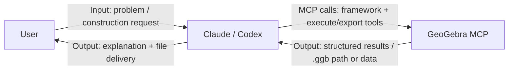

# GeoGebra MCP Tool

A GeoGebra MCP server for geometric construction, function plotting, and file export (including `.ggb`).

Chinese documentation: [README.zh-CN.md](README.zh-CN.md)

## What This Project Is

- This is an **MCP server**, not a chat app.
- Natural-language understanding is handled by clients such as Claude/Codex.
- This project executes GeoGebra tool calls and exports output files.

## Quick Start

### 1. Install and Build

```bash
npm install
npm run build
```

### 2. Run Server

```bash
node dist/cli.js
```

Or:

```bash
npx @gebrai/gebrai
# or after global install
gebrai
```

### 3. Connect as MCP

Claude Desktop example:

```json
{
  "mcpServers": {
    "geogebra": {
      "command": "node",
      "args": ["/absolute/path/to/gebrai/dist/cli.js"]
    }
  }
}
```

## Typical Flow (Natural Language -> .ggb)

1. Describe a geometry problem in Claude/Codex.
2. The client calls MCP tools to build the construction.
3. Call `geogebra_export_ggb` to write `output/*.ggb`.

`geogebra_export_ggb` label controls:
- Default label mode is `points_only` (circle/segment/line labels are hidden).
- Pass `visibleLabels` to show only labels explicitly present in the target problem/figure.

Recommended fast path:

- `geogebra_clear_construction`
- `geogebra_eval_commands`
- `geogebra_export_ggb`

## Prompt Framework (Client-Driven LLM)

This server includes `geogebra_get_prompt_framework`:

- MCP provides a reusable construction framework/prompt template
- Client LLMs (Codex/Claude) read it and generate command sequences
- MCP executes those commands via `geogebra_eval_commands`

So generation remains client-driven, with no extra server-side LLM key requirement.



How it works:

1. The user interacts only with Claude/Codex.
2. Claude/Codex interprets the task and generates commands, then calls MCP tools.
3. MCP handles GeoGebra-side execution/export and returns results to the client.

## CLI Options

```bash
node dist/cli.js --help
node dist/cli.js --version
node dist/cli.js --log-level debug
```

## Project Structure

```text
src/          # core implementation
tests/        # tests
package.json  # scripts and dependencies
tsconfig.json # TypeScript config
jest.config.js
```

## Notes

- This project can export `.ggb` directly.
- After source changes, run `npm run build` so clients use the updated logic.
