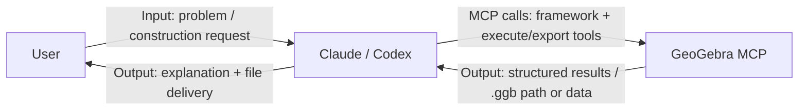

# GeoGebra MCP Tool

[](https://www.npmjs.com/package/@lydt/geogebra-mcp-server)
[](https://www.npmjs.com/package/@lydt/geogebra-mcp-server)
[](https://github.com/YZDame/geogebra-mcp-server/blob/main/LICENSE)


A GeoGebra MCP server for geometric construction, function plotting, and file export (including `.ggb`).

中文说明请看: [README.zh-CN.md](README.zh-CN.md)

## Origin and Fork Policy

- This project is forked from [efebausal/gebrai](https://github.com/efebausal/gebrai).
- The upstream repository is MIT licensed, and this project keeps the MIT license and attribution.
- This fork is maintained independently with its own release cycle and npm package name.

## Migration from `@gebrai/gebrai`

If you were using the older package name:

1. Replace install/run commands:
   - Old: `npx @gebrai/gebrai`
   - New: `npx @lydt/geogebra-mcp-server`
2. Replace global CLI command:
   - Old: `gebrai`
   - New: `geogebra-mcp`
3. Update MCP config path to this repository/package location:
   - Example: `.../geogebra-mcp-server/dist/cli.js`

## What This Project Is

- This is an **MCP server**, not a chat app.
- Natural-language understanding is handled by clients such as Claude/Codex.
- This project executes GeoGebra tool calls and exports output files.

## Quick Start

### 1. Install from npm

```bash
npm i @lydt/geogebra-mcp-server
```

You can run it directly:

```bash
npx @lydt/geogebra-mcp-server
```

Or install globally:

```bash
npm i -g @lydt/geogebra-mcp-server
geogebra-mcp
```

### 2. Install and Build from source

```bash
npm install
npm run build
```

### 3. Run Server

```bash
node dist/cli.js
```

Or:

```bash
npx @lydt/geogebra-mcp-server
# or after global install
geogebra-mcp
```

### 4. Connect as MCP

Claude Desktop example:

```json
{
  "mcpServers": {
    "geogebra": {
      "command": "node",
      "args": ["/absolute/path/to/geogebra-mcp-server/dist/cli.js"]
    }
  }
}
```

## Typical Flow (Natural Language -> .ggb)

1. Describe a geometry problem in Claude/Codex.
2. The client calls MCP tools to build the construction.
3. Call `geogebra_export_ggb` to write `output/*.ggb`.

`geogebra_export_ggb` label controls:
- Default label mode is `points_only` (circle/segment/line labels are hidden).
- Pass `visibleLabels` to show only labels explicitly present in the target problem/figure.

Recommended fast path:

- `geogebra_clear_construction`
- `geogebra_eval_commands`
- `geogebra_export_ggb`

## Prompt Framework (Client-Driven LLM)

This server includes `geogebra_get_prompt_framework`:

- MCP provides a reusable construction framework/prompt template
- Client LLMs (Codex/Claude) read it and generate command sequences
- MCP executes those commands via `geogebra_eval_commands`

So generation remains client-driven, with no extra server-side LLM key requirement.



How it works:

1. The user interacts only with Claude/Codex.
2. Claude/Codex interprets the task and generates commands, then calls MCP tools.
3. MCP handles GeoGebra-side execution/export and returns results to the client.

## Features

This server currently exposes 45 tools in 4 groups:

- Basic server/debug tools: `echo`, `ping`, `server_info`
- GeoGebra core tools: construction, object queries, plotting, CAS, animation, import/export, prompt framework
- Educational tools: template listing/loading and lesson plan generation
- Performance tools: metrics, pool stats, warm-up, benchmark, metric reset

GeoGebra core tools by capability:

- Construction and editing: `geogebra_eval_command`, `geogebra_eval_commands`, `geogebra_create_point`, `geogebra_create_line`, `geogebra_create_circle`, `geogebra_create_polygon`, `geogebra_create_line_segment`, `geogebra_create_text`, `geogebra_create_slider`
- Object/query and canvas management: `geogebra_get_objects`, `geogebra_clear_construction`, `geogebra_instance_status`, `geogebra_auto_zoom`
- Import/export: `geogebra_export_png`, `geogebra_export_svg`, `geogebra_export_pdf`, `geogebra_export_ggb`, `geogebra_load_ggb`
- Plotting and curves: `geogebra_plot_function`, `geogebra_plot_parametric`, `geogebra_plot_implicit`
- CAS and symbolic math: `geogebra_solve_equation`, `geogebra_solve_system`, `geogebra_differentiate`, `geogebra_integrate`, `geogebra_simplify`
- Animation: `geogebra_animate_parameter`, `geogebra_trace_object`, `geogebra_start_animation`, `geogebra_stop_animation`, `geogebra_animation_status`, `geogebra_export_animation`, `geogebra_animation_demo`
- LLM-oriented helper: `geogebra_get_prompt_framework`

## CLI Options

```bash
node dist/cli.js --help
node dist/cli.js --version
node dist/cli.js --log-level debug
```

## Project Structure

```text
src/          # core implementation
tests/        # tests
package.json  # scripts and dependencies
tsconfig.json # TypeScript config
jest.config.js
```

## Notes

- This project can export `.ggb` directly.
- After source changes, run `npm run build` so clients use the updated logic.
