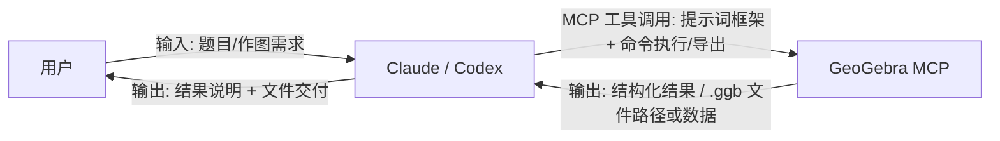

# GeoGebra MCP Tool

[](https://www.npmjs.com/package/@lydt/geogebra-mcp-server)
[](https://www.npmjs.com/package/@lydt/geogebra-mcp-server)
[](https://github.com/YZDame/geogebra-mcp-server/blob/main/LICENSE)


GeoGebra 的 MCP Server，用于几何构造、函数绘图与文件导出（支持 `.ggb`）。

## 来源与 Fork 说明

- 本项目 Fork 自 [efebausal/gebrai](https://github.com/efebausal/gebrai)。
- 上游仓库采用 MIT 许可证，本项目继续保留 MIT 许可证与原始版权声明。
- 当前 Fork 独立维护，使用独立的发布节奏与 npm 包名。

## 从 `@gebrai/gebrai` 迁移

如果你之前使用旧包名，请按下面迁移：

1. 替换安装/运行命令：
   - 旧：`npx @gebrai/gebrai`
   - 新：`npx @lydt/geogebra-mcp-server`
2. 替换全局 CLI 命令：
   - 旧：`gebrai`
   - 新：`geogebra-mcp`
3. 更新 MCP 配置里的本地路径到当前仓库/包目录：
   - 示例：`.../geogebra-mcp-server/dist/cli.js`

## 项目定位

- 这是一个 **MCP Server**，不是聊天应用本身。
- 自然语言理解由 Claude/Codex 等客户端完成。
- 本项目负责执行 GeoGebra 工具调用并导出图形文件。

## 快速开始

### 1. 通过 npm 安装

```bash
npm i @lydt/geogebra-mcp-server
```

可直接运行：

```bash
npx @lydt/geogebra-mcp-server
```

或全局安装：

```bash
npm i -g @lydt/geogebra-mcp-server
geogebra-mcp
```

### 2. 从源码安装并构建

```bash
npm install
npm run build
```

### 3. 启动服务

```bash
node dist/cli.js
```

也可以：

```bash
npx @lydt/geogebra-mcp-server
# 或全局安装后
geogebra-mcp
```

### 4. 作为 MCP 接入客户端

以 Claude Desktop 为例：

```json
{
  "mcpServers": {
    "geogebra": {
      "command": "node",
      "args": ["/你的绝对路径/geogebra-mcp-server/dist/cli.js"]
    }
  }
}
```

## 典型流程（自然语言 -> .ggb）

1. 在 Claude/Codex 中输入几何题目或作图需求。
2. 客户端通过 MCP 调用本项目工具构造图形。
3. 调用 `geogebra_export_ggb` 导出到 `output/*.ggb`。

`geogebra_export_ggb` 标签控制：
- 默认标签模式是 `points_only`（圆、线段、直线等标签默认隐藏）。
- 传入 `visibleLabels` 可只显示题目/配图中明确出现的标签。

推荐高效链路：

- `geogebra_clear_construction`
- `geogebra_eval_commands`
- `geogebra_export_ggb`

## 内置提示词框架（由客户端大模型生成）

现在内置了 `geogebra_get_prompt_framework` 工具：

- MCP 提供可复用的构图提示词框架
- 由 Codex/Claude 等客户端大模型理解并生成命令序列
- 再通过 `geogebra_eval_commands` 在 MCP 中执行

也就是说：生成逻辑由客户端模型承担，不需要在 MCP 里额外配置服务端 LLM API Key。



工作原理简述：

1. 用户只和 Claude/Codex 交互，输入题目。
2. Claude/Codex 负责理解题意与生成命令，再通过 MCP 执行。
3. MCP 负责 GeoGebra 侧能力（执行、查询、导出），并把结果返回给客户端。

## 功能特性

当前服务端一共暴露了 45 个工具，分为 4 组：

- 基础服务/调试工具：`echo`、`ping`、`server_info`
- GeoGebra 核心工具：构图、查询、绘图、CAS、动画、导入导出、提示词框架
- 教学模板工具：模板列表、模板加载、课程方案生成
- 性能工具：性能指标、实例池状态、预热、压测、指标清理

其中 GeoGebra 核心工具可以按用途理解为：

- 构图与编辑：`geogebra_eval_command`、`geogebra_eval_commands`、`geogebra_create_point`、`geogebra_create_line`、`geogebra_create_circle`、`geogebra_create_polygon`、`geogebra_create_line_segment`、`geogebra_create_text`、`geogebra_create_slider`
- 对象查询与画布管理：`geogebra_get_objects`、`geogebra_clear_construction`、`geogebra_instance_status`、`geogebra_auto_zoom`
- 导入导出：`geogebra_export_png`、`geogebra_export_svg`、`geogebra_export_pdf`、`geogebra_export_ggb`、`geogebra_load_ggb`
- 函数与曲线：`geogebra_plot_function`、`geogebra_plot_parametric`、`geogebra_plot_implicit`
- 代数与符号计算：`geogebra_solve_equation`、`geogebra_solve_system`、`geogebra_differentiate`、`geogebra_integrate`、`geogebra_simplify`
- 动画：`geogebra_animate_parameter`、`geogebra_trace_object`、`geogebra_start_animation`、`geogebra_stop_animation`、`geogebra_animation_status`、`geogebra_export_animation`、`geogebra_animation_demo`
- 面向大模型的辅助能力：`geogebra_get_prompt_framework`

## CLI 用法

```bash
node dist/cli.js --help
node dist/cli.js --version
node dist/cli.js --log-level debug
```

## 项目结构（精简后）

```text
src/          # 核心实现
tests/        # 测试
package.json  # 依赖与脚本
tsconfig.json # TypeScript 配置
jest.config.js
```

## 说明

- 项目当前可直接导出 `.ggb`。
- 若修改了源码，需重新执行 `npm run build`，客户端才会使用新逻辑。
