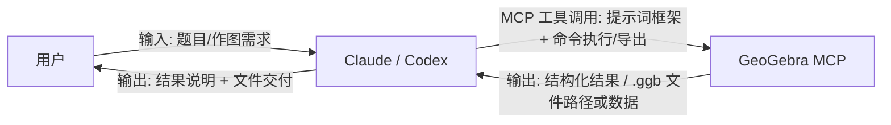

# GeoGebra MCP Tool

GeoGebra 的 MCP Server，用于几何构造、函数绘图与文件导出（支持 `.ggb`）。

## 项目定位

- 这是一个 **MCP Server**，不是聊天应用本身。
- 自然语言理解由 Claude/Codex 等客户端完成。
- 本项目负责执行 GeoGebra 工具调用并导出图形文件。

## 快速开始

### 1. 安装并构建

```bash
npm install
npm run build
```

### 2. 启动服务

```bash
node dist/cli.js
```

也可以：

```bash
npx @gebrai/gebrai
# 或全局安装后
gebrai
```

### 3. 作为 MCP 接入客户端

以 Claude Desktop 为例：

```json
{
  "mcpServers": {
    "geogebra": {
      "command": "node",
      "args": ["/你的绝对路径/gebrai/dist/cli.js"]
    }
  }
}
```

## 典型流程（自然语言 -> .ggb）

1. 在 Claude/Codex 中输入几何题目或作图需求。
2. 客户端通过 MCP 调用本项目工具构造图形。
3. 调用 `geogebra_export_ggb` 导出到 `output/*.ggb`。

推荐高效链路：

- `geogebra_clear_construction`
- `geogebra_eval_commands`
- `geogebra_export_ggb`

## 内置提示词框架（由客户端大模型生成）

现在内置了 `geogebra_get_prompt_framework` 工具：

- MCP 提供可复用的构图提示词框架
- 由 Codex/Claude 等客户端大模型理解并生成命令序列
- 再通过 `geogebra_eval_commands` 在 MCP 中执行

也就是说：生成逻辑由客户端模型承担，不需要在 MCP 里额外配置服务端 LLM API Key。



工作原理简述：

1. 用户只和 Claude/Codex 交互，输入题目。
2. Claude/Codex 负责理解题意与生成命令，再通过 MCP 执行。
3. MCP 负责 GeoGebra 侧能力（执行、查询、导出），并把结果返回给客户端。

## CLI 用法

```bash
node dist/cli.js --help
node dist/cli.js --version
node dist/cli.js --log-level debug
```

## 项目结构（精简后）

```text
src/          # 核心实现
tests/        # 测试
package.json  # 依赖与脚本
tsconfig.json # TypeScript 配置
jest.config.js
```

## 说明

- 项目当前可直接导出 `.ggb`。
- 若修改了源码，需重新执行 `npm run build`，客户端才会使用新逻辑。
